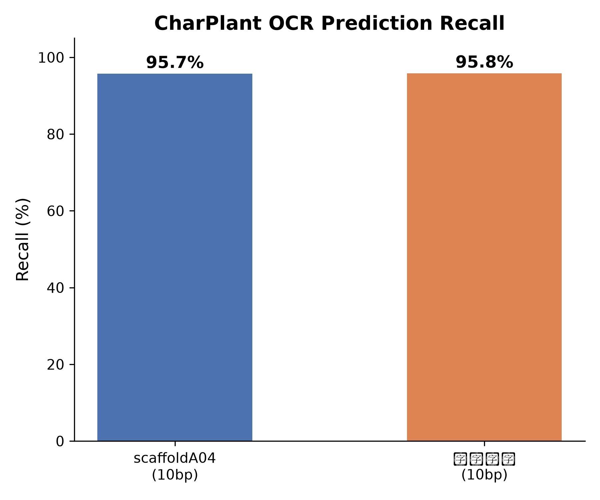
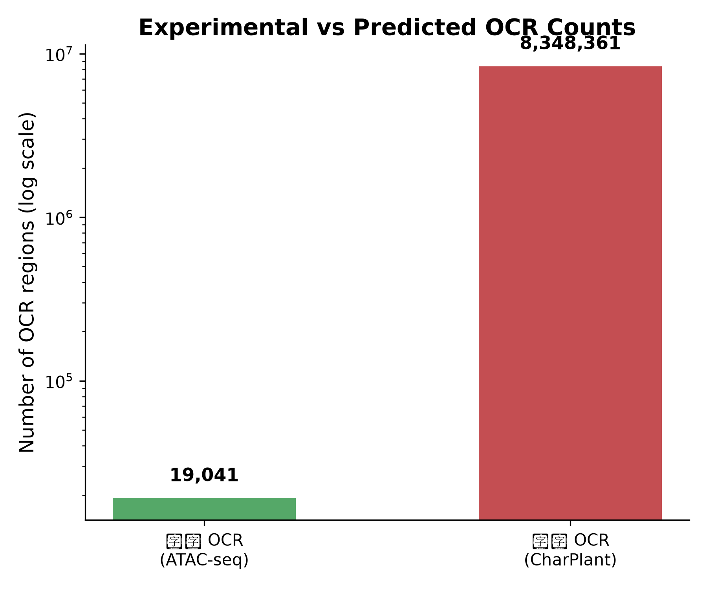
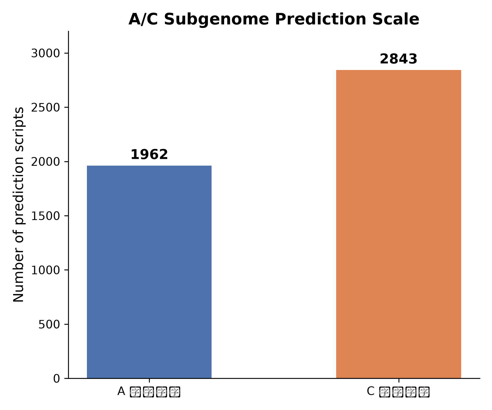

# 结果汇总

## 1. 数据统计

| 项目 | 数值 |
|:---|:---|
| ZS11 基因组大小 | 1,010,887,456 bp（约 1.01 Gb） |
| ATAC-seq 总 reads | 约 1.02 亿（每个重复） |
| 比对率 | 88.13% / 89.90% |
| properly paired | 75.38% / 77.06% |
| 去重率 | 24.8% / 19.6% |
| OCR 总数 | 19,041 |

## 2. 模型训练

| 指标 | 数值 |
|:---|:---|
| 训练轮数 | 150 |
| 最优 val_loss | 0.1933（第 148 轮） |
| 最优 val_acc | 92.36% |

## 3. 从头预测

| 指标 | scaffoldA04 (10bp) | 全基因组(10bp) |
|:---|:---|:---|
| 实验 OCR 总数 | 491 | 19,041 |
| 被预测覆盖 | 470 | 18,247 |
| 召回率 | 95.7% | 95.8% |
| 预测 OCR 总数（合并后） | 219,937 | 8,348,361 |

## 4. 待补充

- A 亚基因组全量预测结果（已完成）
- C 亚基因组全量预测结果（已完成）
- 1bp vs 10bp 步长对比
- 全基因组召回率（已完成）
- 预测 OCR 的 H3K4me3 信号富集分析（暂时找不到ZS11.v0相同规格文件）

## 5. 结果图

### 召回率对比

### 预测 vs 实验 OCR 数量

### A/C 亚基因组预测规模

